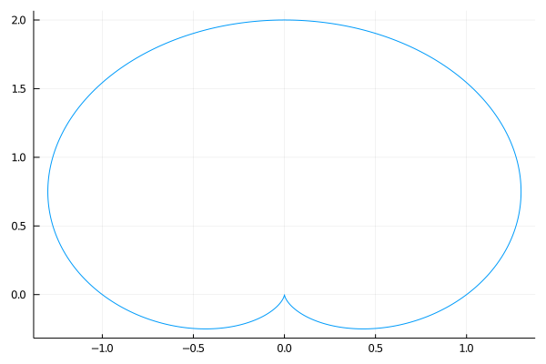
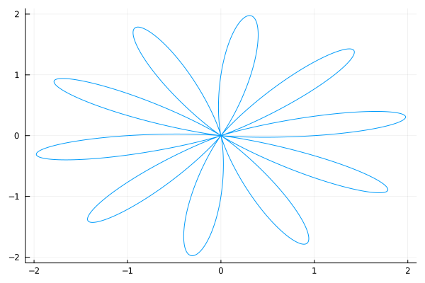
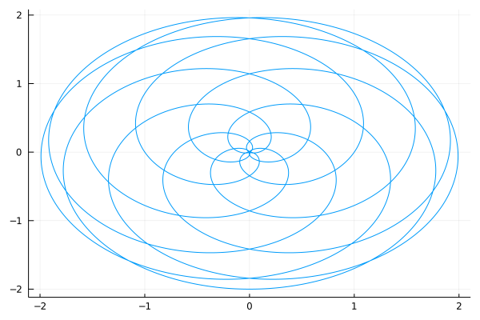
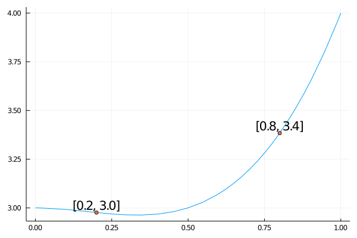

# Pakiety do wszystkich zadań

```julia
using DataFrames
using StatsBase
using CSV
using Plots
#using StatsPlots
using StringEncodings
using RDatasets
using Literate # Literate.markdown("rozdzial1/rozdzial-1.jl", "rozdzial1/"; documenter=false, execute=true)
```

# R Zadanie 1.1
Skonstruuj wektor kwadratów liczb od 1 do 100. Następnie używając operatora dzielenia modulo i funkcji factor() zlicz, które cyfry oraz jak często występują na pozycji jedności w wyznaczonych kwadratach.

```julia
wektor = (1:100).^2
sort(countmap(wektor .% 10))
```

```
OrderedCollections.OrderedDict{Int64,Int64} with 6 entries:
  0 => 10
  1 => 20
  4 => 20
  5 => 10
  6 => 20
  9 => 20
```

# RR Zadanie 1.2
Zbuduj własne tablice trygonometryczne. Przygotuj ramkę danych, w których zebrane będą informacje o wartościach funkcji sinus, cosinus, tangens i cotangens dla kątów: $0^{\circ}$ , $30^{\circ}$ , $45^{\circ}$ , $60^{\circ}$ , $90^{\circ}$ . Zauważ, że funkcje trygonometryczne w R przyjmują argumenty w radianach.

```julia
rad2dec(x) = x*π/180
x = rad2dec.([0,30,45,60,90])
DataFrame("sin" => sin.(x), "cos" => cos.(x), "tan" => tan.(x), "atan" => 1 ./tan.(x))
```

```
5×4 DataFrame
│ Row │ sin      │ cos         │ tan        │ atan        │
│     │ Float64  │ Float64     │ Float64    │ Float64     │
├─────┼──────────┼─────────────┼────────────┼─────────────┤
│ 1   │ 0.0      │ 1.0         │ 0.0        │ Inf         │
│ 2   │ 0.5      │ 0.866025    │ 0.57735    │ 1.73205     │
│ 3   │ 0.707107 │ 0.707107    │ 1.0        │ 1.0         │
│ 4   │ 0.866025 │ 0.5         │ 1.73205    │ 0.57735     │
│ 5   │ 1.0      │ 6.12323e-17 │ 1.63312e16 │ 6.12323e-17 │
```

# R Zadanie 1.3
Przygotuj wektor 30 łańcuchów znaków następującej postaci: liczba.litera, gdzie liczba to kolejne liczby od 1 do 30 a litera to trzy duże litery A, B, C występujące cyklicznie.

```julia
string.(collect(1:30)) .* "." .* repeat(["A", "B", "C"], 10)
```

```
30-element Array{String,1}:
 "1.A"
 "2.B"
 "3.C"
 "4.A"
 "5.B"
 "6.C"
 "7.A"
 "8.B"
 "9.C"
 "10.A"
 "11.B"
 "12.C"
 "13.A"
 "14.B"
 "15.C"
 "16.A"
 "17.B"
 "18.C"
 "19.A"
 "20.B"
 "21.C"
 "22.A"
 "23.B"
 "24.C"
 "25.A"
 "26.B"
 "27.C"
 "28.A"
 "29.B"
 "30.C"
```

# R Zadanie 1.4
Wczytaj zbiór danych `daneO` i napisz funkcję lub pętlę sprawdzającą typ i klasę każdej kolumny tego zbioru.
*Uwaga:* tu jest trochę zabawy bo pierwsza kolumna zaiwera indeksy ale nie ma nazwy więc trochę trzeba do obejść

```julia
download("http://www.biecek.pl/R/dane/daneO.csv", "rozdzial1/daneO.csv")
daneO = CSV.read("rozdzial1/daneO.csv", DataFrame, limit=1); ## colnames
daneO = CSV.read("rozdzial1/daneO.csv", DataFrame, header = vcat("id", names(daneO)), delim = ";",
                 datarow = 2, missingstring = "NA")
select!(daneO, Not(:id))

for col in eachcol(daneO)
    println("klasa: ", eltype(col), ", typ: " , typeof(col))
end
```

```
┌ Warning: thread = 1 warning: parsed expected 9 columns, but didn't reach end of line around data row: 2. Ignoring any extra columns on this row
└ @ CSV /Users/berenz/.julia/packages/CSV/la2cd/src/file.jl:604
klasa: Int64, typ: Array{Int64,1}
klasa: Int64, typ: Array{Int64,1}
klasa: Int64, typ: Array{Int64,1}
klasa: Union{Missing, Int64}, typ: SentinelArrays.SentinelArray{Int64,1,Int64,Missing,Array{Int64,1}}
klasa: Union{Missing, String}, typ: PooledArrays.PooledArray{Union{Missing, String},UInt32,1,Array{UInt32,1}}
klasa: Union{Missing, String}, typ: PooledArrays.PooledArray{Union{Missing, String},UInt32,1,Array{UInt32,1}}
klasa: String, typ: PooledArrays.PooledArray{String,UInt32,1,Array{UInt32,1}}
klasa: Union{Missing, Int64}, typ: SentinelArrays.SentinelArray{Int64,1,Int64,Missing,Array{Int64,1}}
klasa: Int64, typ: Array{Int64,1}

```

albo jak w rozwiązaniu z R

```julia
for (ind, col) in enumerate(eachcol(daneO))
    println(names(daneO)[ind], ": klasa: ", eltype(col), ", typ: " , typeof(col))
end
```

```
Wiek: klasa: Int64, typ: Array{Int64,1}
Rozmiar.guza: klasa: Int64, typ: Array{Int64,1}
Wezly.chlonne: klasa: Int64, typ: Array{Int64,1}
Nowotwor: klasa: Union{Missing, Int64}, typ: SentinelArrays.SentinelArray{Int64,1,Int64,Missing,Array{Int64,1}}
Receptory.estrogenowe: klasa: Union{Missing, String}, typ: PooledArrays.PooledArray{Union{Missing, String},UInt32,1,Array{UInt32,1}}
Receptory.progesteronowe: klasa: Union{Missing, String}, typ: PooledArrays.PooledArray{Union{Missing, String},UInt32,1,Array{UInt32,1}}
Niepowodzenia: klasa: String, typ: PooledArrays.PooledArray{String,UInt32,1,Array{UInt32,1}}
Okres.bez.wznowy: klasa: Union{Missing, Int64}, typ: SentinelArrays.SentinelArray{Int64,1,Int64,Missing,Array{Int64,1}}
VEGF: klasa: Int64, typ: Array{Int64,1}

```

# R Zadanie 1.5
Z odczytanej ramki danych `dane0` wyświetl tylko dane z wierszy o parzystych indeksach.

```julia
daneO[2:2:end, :]
```

```
48×9 DataFrame
│ Row │ Wiek  │ Rozmiar.guza │ Wezly.chlonne │ Nowotwor │ Receptory.estrogenowe │ Receptory.progesteronowe │ Niepowodzenia │ Okres.bez.wznowy │ VEGF  │
│     │ Int64 │ Int64        │ Int64         │ Int64?   │ String?               │ Union{Missing, String}   │ String        │ Int64?           │ Int64 │
├─────┼───────┼──────────────┼───────────────┼──────────┼───────────────────────┼──────────────────────────┼───────────────┼──────────────────┼───────┤
│ 1   │ 29    │ 1            │ 0             │ 2        │ (++)                  │ (++)                     │ brak          │ 53               │ 1118  │
│ 2   │ 32    │ 1            │ 0             │ 3        │ (++)                  │ (++)                     │ brak          │ 26               │ 1793  │
│ 3   │ 33    │ 1            │ 1             │ 3        │ (-)                   │ (++)                     │ wznowa        │ 36               │ 2776  │
│ 4   │ 35    │ 2            │ 1             │ 2        │ (+)                   │ (++)                     │ brak          │ 38               │ 3827  │
│ 5   │ 36    │ 1            │ 1             │ 2        │ (-)                   │ (++)                     │ brak          │ 37               │ 834   │
│ 6   │ 37    │ 1            │ 0             │ 3        │ (-)                   │ (+)                      │ wznowa        │ 40               │ 3331  │
│ 7   │ 38    │ 1            │ 1             │ 3        │ (++)                  │ (+++)                    │ wznowa        │ 16               │ 2759  │
│ 8   │ 40    │ 1            │ 1             │ 2        │ (+)                   │ (++)                     │ brak          │ 27               │ 3038  │
│ 9   │ 41    │ 1            │ 1             │ 2        │ missing               │ missing                  │ brak          │ 19               │ 1981  │
│ 10  │ 41    │ 1            │ 0             │ 3        │ (+)                   │ (-)                      │ brak          │ 18               │ 989   │
│ 11  │ 42    │ 1            │ 1             │ 2        │ (+++)                 │ (++)                     │ wznowa        │ 29               │ 5994  │
│ 12  │ 42    │ 1            │ 1             │ 2        │ (+++)                 │ (+++)                    │ brak          │ 47               │ 532   │
│ 13  │ 42    │ 1            │ 0             │ missing  │ (-)                   │ (+)                      │ brak          │ 33               │ 1531  │
│ 14  │ 43    │ 1            │ 0             │ 3        │ missing               │ missing                  │ brak          │ 39               │ 1348  │
│ 15  │ 44    │ 1            │ 0             │ 1        │ (++)                  │ (+)                      │ brak          │ 47               │ 2402  │
│ 16  │ 44    │ 2            │ 0             │ 2        │ (++)                  │ (+++)                    │ brak          │ 48               │ 483   │
│ 17  │ 44    │ 1            │ 1             │ 3        │ (+)                   │ (++)                     │ brak          │ 36               │ 596   │
│ 18  │ 44    │ 2            │ 1             │ 3        │ (-)                   │ (-)                      │ brak          │ 53               │ 164   │
│ 19  │ 45    │ 1            │ 0             │ 2        │ (+++)                 │ (++)                     │ brak          │ 33               │ 951   │
│ 20  │ 45    │ 1            │ 1             │ 2        │ (++)                  │ (++)                     │ brak          │ 54               │ 1275  │
│ 21  │ 46    │ 1            │ 0             │ 2        │ (+)                   │ (+++)                    │ brak          │ 23               │ 2018  │
│ 22  │ 46    │ 1            │ 0             │ 2        │ (++)                  │ (+++)                    │ brak          │ 42               │ 1197  │
│ 23  │ 46    │ 1            │ 0             │ 2        │ (+)                   │ (++)                     │ brak          │ 51               │ 780   │
│ 24  │ 46    │ 1            │ 1             │ 3        │ (-)                   │ (+)                      │ brak          │ 36               │ 2703  │
│ 25  │ 46    │ 1            │ 0             │ missing  │ missing               │ missing                  │ brak          │ 28               │ 1526  │
│ 26  │ 47    │ 1            │ 0             │ 2        │ (+)                   │ (++)                     │ brak          │ 31               │ 286   │
│ 27  │ 47    │ 2            │ 0             │ 2        │ (+++)                 │ (+++)                    │ brak          │ 33               │ 2442  │
│ 28  │ 47    │ 1            │ 0             │ 3        │ (+)                   │ (++)                     │ brak          │ 38               │ 326   │
│ 29  │ 48    │ 1            │ 1             │ 3        │ (-)                   │ (-)                      │ wznowa        │ 21               │ 5194  │
│ 30  │ 49    │ 1            │ 0             │ 1        │ (++)                  │ (++)                     │ brak          │ 36               │ 4355  │
│ 31  │ 49    │ 1            │ 1             │ 2        │ (+)                   │ (++)                     │ brak          │ 36               │ 3101  │
│ 32  │ 49    │ 2            │ 1             │ 3        │ (-)                   │ (-)                      │ brak          │ 39               │ 189   │
│ 33  │ 50    │ 2            │ 1             │ 1        │ (-)                   │ (-)                      │ brak          │ 28               │ 1485  │
│ 34  │ 50    │ 1            │ 0             │ 2        │ (++)                  │ (+++)                    │ brak          │ 29               │ 118   │
│ 35  │ 50    │ 2            │ 1             │ 2        │ (++)                  │ (-)                      │ brak          │ 33               │ 1694  │
│ 36  │ 50    │ 2            │ 0             │ 3        │ (-)                   │ (-)                      │ brak          │ 39               │ 1738  │
│ 37  │ 50    │ 2            │ 1             │ 3        │ (+++)                 │ (+++)                    │ brak          │ 49               │ 3946  │
│ 38  │ 50    │ 2            │ 1             │ missing  │ (+++)                 │ (-)                      │ brak          │ 27               │ 7665  │
│ 39  │ 51    │ 1            │ 1             │ 2        │ (++)                  │ (++)                     │ brak          │ 33               │ 629   │
│ 40  │ 51    │ 1            │ 0             │ 2        │ (+)                   │ (+++)                    │ brak          │ 50               │ 223   │
│ 41  │ 51    │ 2            │ 0             │ 3        │ (-)                   │ (-)                      │ wznowa        │ 10               │ 13953 │
│ 42  │ 51    │ 2            │ 1             │ missing  │ (-)                   │ (-)                      │ brak          │ 30               │ 8064  │
│ 43  │ 52    │ 1            │ 0             │ 2        │ (++)                  │ (++)                     │ brak          │ 42               │ 357   │
│ 44  │ 52    │ 2            │ 1             │ 2        │ (+)                   │ (+)                      │ wznowa        │ 48               │ 1927  │
│ 45  │ 52    │ 1            │ 0             │ missing  │ (-)                   │ (+)                      │ brak          │ 48               │ 3547  │
│ 46  │ 53    │ 1            │ 0             │ 3        │ (-)                   │ (-)                      │ wznowa        │ 50               │ 590   │
│ 47  │ 55    │ 1            │ 0             │ 1        │ (+)                   │ (++)                     │ brak          │ 36               │ 1354  │
│ 48  │ 55    │ 1            │ 0             │ missing  │ missing               │ missing                  │ brak          │ missing          │ 1255  │
```

# R Zadanie 1.6
Używając operatorów logicznych wyświetl ze zbioru danych tylko wiersze odpowiadające: pacjentkom starszym niż 50 lat u których wystąpiły przerzuty do węzłów chłonnych (cecha Wezly.chlonne=1).

```julia
daneO[(daneO.Wiek .< 50) .& (daneO."Wezly.chlonne" .==1),:]
```

```
27×9 DataFrame
│ Row │ Wiek  │ Rozmiar.guza │ Wezly.chlonne │ Nowotwor │ Receptory.estrogenowe │ Receptory.progesteronowe │ Niepowodzenia │ Okres.bez.wznowy │ VEGF  │
│     │ Int64 │ Int64        │ Int64         │ Int64?   │ String?               │ Union{Missing, String}   │ String        │ Int64?           │ Int64 │
├─────┼───────┼──────────────┼───────────────┼──────────┼───────────────────────┼──────────────────────────┼───────────────┼──────────────────┼───────┤
│ 1   │ 30    │ 1            │ 1             │ 2        │ (-)                   │ (+)                      │ brak          │ 38               │ 630   │
│ 2   │ 33    │ 1            │ 1             │ 3        │ (-)                   │ (++)                     │ wznowa        │ 36               │ 2776  │
│ 3   │ 35    │ 2            │ 1             │ 2        │ (+)                   │ (++)                     │ brak          │ 38               │ 3827  │
│ 4   │ 35    │ 1            │ 1             │ 3        │ (-)                   │ (-)                      │ wznowa        │ 38               │ 22554 │
│ 5   │ 36    │ 1            │ 1             │ 2        │ (-)                   │ (++)                     │ brak          │ 37               │ 834   │
│ 6   │ 38    │ 1            │ 1             │ 3        │ (++)                  │ (+++)                    │ wznowa        │ 16               │ 2759  │
│ 7   │ 38    │ 1            │ 1             │ 3        │ (-)                   │ (-)                      │ brak          │ 44               │ 511   │
│ 8   │ 40    │ 1            │ 1             │ 2        │ (+)                   │ (++)                     │ brak          │ 27               │ 3038  │
│ 9   │ 40    │ 1            │ 1             │ 2        │ (-)                   │ (++)                     │ brak          │ 36               │ 1027  │
│ 10  │ 41    │ 1            │ 1             │ 2        │ missing               │ missing                  │ brak          │ 19               │ 1981  │
│ 11  │ 41    │ 2            │ 1             │ 2        │ (++)                  │ (+++)                    │ brak          │ 41               │ 1489  │
│ 12  │ 41    │ 1            │ 1             │ 3        │ (+)                   │ (+)                      │ wznowa        │ 41               │ 6175  │
│ 13  │ 42    │ 1            │ 1             │ 2        │ (+++)                 │ (++)                     │ wznowa        │ 29               │ 5994  │
│ 14  │ 42    │ 1            │ 1             │ 2        │ (++)                  │ (++)                     │ brak          │ 47               │ 3673  │
│ 15  │ 42    │ 1            │ 1             │ 2        │ (+++)                 │ (+++)                    │ brak          │ 47               │ 532   │
│ 16  │ 42    │ 2            │ 1             │ missing  │ (-)                   │ (+)                      │ brak          │ 30               │ 1339  │
│ 17  │ 44    │ 1            │ 1             │ 3        │ (+)                   │ (++)                     │ brak          │ 36               │ 596   │
│ 18  │ 44    │ 2            │ 1             │ 3        │ (-)                   │ (-)                      │ brak          │ 53               │ 164   │
│ 19  │ 44    │ 1            │ 1             │ missing  │ (-)                   │ (-)                      │ brak          │ 38               │ 3836  │
│ 20  │ 45    │ 1            │ 1             │ 2        │ (++)                  │ (++)                     │ brak          │ 54               │ 1275  │
│ 21  │ 46    │ 1            │ 1             │ 2        │ (-)                   │ (-)                      │ brak          │ 42               │ 18201 │
│ 22  │ 46    │ 1            │ 1             │ 3        │ (-)                   │ (+)                      │ brak          │ 36               │ 2703  │
│ 23  │ 46    │ 1            │ 1             │ 3        │ (+)                   │ (++)                     │ brak          │ 38               │ 770   │
│ 24  │ 47    │ 2            │ 1             │ 2        │ (-)                   │ (-)                      │ brak          │ 42               │ 4188  │
│ 25  │ 48    │ 1            │ 1             │ 3        │ (-)                   │ (-)                      │ wznowa        │ 21               │ 5194  │
│ 26  │ 49    │ 1            │ 1             │ 2        │ (+)                   │ (++)                     │ brak          │ 36               │ 3101  │
│ 27  │ 49    │ 2            │ 1             │ 3        │ (-)                   │ (-)                      │ brak          │ 39               │ 189   │
```

alternatywnie z operatorem @.

```julia
@. daneO[(daneO.Wiek < 50) & (daneO."Wezly.chlonne" == 1), :]
```

```
27×9 DataFrame
│ Row │ Wiek  │ Rozmiar.guza │ Wezly.chlonne │ Nowotwor │ Receptory.estrogenowe │ Receptory.progesteronowe │ Niepowodzenia │ Okres.bez.wznowy │ VEGF  │
│     │ Int64 │ Int64        │ Int64         │ Int64?   │ String?               │ Union{Missing, String}   │ String        │ Int64?           │ Int64 │
├─────┼───────┼──────────────┼───────────────┼──────────┼───────────────────────┼──────────────────────────┼───────────────┼──────────────────┼───────┤
│ 1   │ 30    │ 1            │ 1             │ 2        │ (-)                   │ (+)                      │ brak          │ 38               │ 630   │
│ 2   │ 33    │ 1            │ 1             │ 3        │ (-)                   │ (++)                     │ wznowa        │ 36               │ 2776  │
│ 3   │ 35    │ 2            │ 1             │ 2        │ (+)                   │ (++)                     │ brak          │ 38               │ 3827  │
│ 4   │ 35    │ 1            │ 1             │ 3        │ (-)                   │ (-)                      │ wznowa        │ 38               │ 22554 │
│ 5   │ 36    │ 1            │ 1             │ 2        │ (-)                   │ (++)                     │ brak          │ 37               │ 834   │
│ 6   │ 38    │ 1            │ 1             │ 3        │ (++)                  │ (+++)                    │ wznowa        │ 16               │ 2759  │
│ 7   │ 38    │ 1            │ 1             │ 3        │ (-)                   │ (-)                      │ brak          │ 44               │ 511   │
│ 8   │ 40    │ 1            │ 1             │ 2        │ (+)                   │ (++)                     │ brak          │ 27               │ 3038  │
│ 9   │ 40    │ 1            │ 1             │ 2        │ (-)                   │ (++)                     │ brak          │ 36               │ 1027  │
│ 10  │ 41    │ 1            │ 1             │ 2        │ missing               │ missing                  │ brak          │ 19               │ 1981  │
│ 11  │ 41    │ 2            │ 1             │ 2        │ (++)                  │ (+++)                    │ brak          │ 41               │ 1489  │
│ 12  │ 41    │ 1            │ 1             │ 3        │ (+)                   │ (+)                      │ wznowa        │ 41               │ 6175  │
│ 13  │ 42    │ 1            │ 1             │ 2        │ (+++)                 │ (++)                     │ wznowa        │ 29               │ 5994  │
│ 14  │ 42    │ 1            │ 1             │ 2        │ (++)                  │ (++)                     │ brak          │ 47               │ 3673  │
│ 15  │ 42    │ 1            │ 1             │ 2        │ (+++)                 │ (+++)                    │ brak          │ 47               │ 532   │
│ 16  │ 42    │ 2            │ 1             │ missing  │ (-)                   │ (+)                      │ brak          │ 30               │ 1339  │
│ 17  │ 44    │ 1            │ 1             │ 3        │ (+)                   │ (++)                     │ brak          │ 36               │ 596   │
│ 18  │ 44    │ 2            │ 1             │ 3        │ (-)                   │ (-)                      │ brak          │ 53               │ 164   │
│ 19  │ 44    │ 1            │ 1             │ missing  │ (-)                   │ (-)                      │ brak          │ 38               │ 3836  │
│ 20  │ 45    │ 1            │ 1             │ 2        │ (++)                  │ (++)                     │ brak          │ 54               │ 1275  │
│ 21  │ 46    │ 1            │ 1             │ 2        │ (-)                   │ (-)                      │ brak          │ 42               │ 18201 │
│ 22  │ 46    │ 1            │ 1             │ 3        │ (-)                   │ (+)                      │ brak          │ 36               │ 2703  │
│ 23  │ 46    │ 1            │ 1             │ 3        │ (+)                   │ (++)                     │ brak          │ 38               │ 770   │
│ 24  │ 47    │ 2            │ 1             │ 2        │ (-)                   │ (-)                      │ brak          │ 42               │ 4188  │
│ 25  │ 48    │ 1            │ 1             │ 3        │ (-)                   │ (-)                      │ wznowa        │ 21               │ 5194  │
│ 26  │ 49    │ 1            │ 1             │ 2        │ (+)                   │ (++)                     │ brak          │ 36               │ 3101  │
│ 27  │ 49    │ 2            │ 1             │ 3        │ (-)                   │ (-)                      │ brak          │ 39               │ 189   │
```

# R Zadanie 1.7
Wyświetl nazwy kolumn w zbiorze danych daneO, a następnie oblicz długość (liczbę znaków) nazw kolejnych kolumn.

Nazwy

```julia
names(daneO)
```

```
9-element Array{String,1}:
 "Wiek"
 "Rozmiar.guza"
 "Wezly.chlonne"
 "Nowotwor"
 "Receptory.estrogenowe"
 "Receptory.progesteronowe"
 "Niepowodzenia"
 "Okres.bez.wznowy"
 "VEGF"
```

Liczba znaków

```julia
length.(names(daneO))
```

```
9-element Array{Int64,1}:
  4
 12
 13
  8
 21
 24
 13
 16
  4
```

# R Zadanie 1.8
Napisz funkcję, która za argumenty przyjmie wektor liczb, a jako wynik zwróci trzy najmniejsze i trzy największe liczby. Jeżeli wejściowy wektor jest krótszy niż trzy liczby, to wyświetlany powinien być napis “za krótki argument”.

```julia
function skrajne(x)
    if length(x) < 3
        return "za krótki argument"
    else
        sort!(x)
        return x[1:3], x[end-2:end]
    end
end

skrajne(rand(10))
```

```
([0.2340492864467525, 0.24665257494112502, 0.3172776110488833], [0.7255289556505846, 0.7272800812259477, 0.8825409637713251])
```

# RR Zadanie 1.9
Zmodyfjkuj funkcję z poprzedniego zadania tak, by otrzymywała też drugi argument ile, którym można określić liczbę skrajnych wartości wyznaczanych jako wynik. Domyślną wartością tego argumentu powinna być liczba 3.

```julia
function skrajne(x, ile = 3)
    if length(x) < ile
        return "za krótki argument"
    else
        sort!(x)
        return x[1:ile], x[end-(ile-1):end]
    end
end

skrajne(rand(10), 4)
```

```
([0.12116189692301593, 0.2516191391832536, 0.3853195615459821, 0.4310851673597642], [0.6607099706178687, 0.6942039381374301, 0.7297771068570114, 0.7506300096137666])
```

# RR Zadanie 1.10
 Napisz funkcję `poczatek()` przyjmującą za pierwszy argument wektor, macierz lub ramkę a za drugi argument liczbę n. Niech to będzie przeciążona funkcja. Dla wektora powinna ona w wyniku zwracać n pierwszych elementów, dla macierzy i ramki danych powinna zwracać podmacierz o wymiarach n × n.

*UWAGA:* przyklad multiple dispatch

# RR Zadanie 1.11

Napisz funkcję, która w układzie biegunowym ma współrzędne:
\begin{equation}
\begin{cases}
r &= 1 + sin(t) \\
\phi &= c * t
\end{cases}
\end{equation}
dla $c \in \{1, 1.1, 2.2 \}$

```
Wskazówka: trzeba zamienić współrzędne na układ kartezjański przekształceniami x=rcos(ϕ) i y=rsin(ϕ). Autor upierał się, że tego uczą w gimnazjum i takie podpowiedzi są zbędne, ale prawda jest taka, że autor nigdy nie był w gimnazjum. Przyp. żony.
```

```julia
function rysuj(c, max=100)
    t = 0:0.001:max
    r = 1 .+ sin.(t)
    ϕ = c*t
    x = r .* cos.(ϕ)
    y = r .* sin.(ϕ)
    plot(x, y,  legend = false)
end
```

```
rysuj (generic function with 2 methods)
```

c=1

```julia
rysuj(1)
```


c=0.1

```julia
rysuj(0.1)
```


c=2.2

```julia
rysuj(2.2)
```


# R Zadanie 1.12
Używając instrukcji curve() narysuj wykres funkcji $f(x)=2x^3-x^2+3$ na przedziale [0, 1].

Na wykresie tej funkcji zaznacz punkty odpowiadające wartościom w punktach 0.2 i 0.8, a następnie na wykres nanieś napisy opisujące współrzędne tych punktów.

```julia
fun(x) = 2*x^3-x^2+3

plot(fun, 0, 1, legend = false) ## jak funkcja curve
scatter!([0.2, 0.8], fun.([0.2, 0.8]))
annotate!(0.2, fun(0.2), text(string([0.2, round(fun(0.2),digits=1)]), :bottom))
annotate!(0.8, fun(0.8), text(string([0.8, round(fun(0.8),digits=1)]), :bottom))
```


# R Zadanie 1.13
Pod adresem http://www.biecek.pl/R/dane/daneBioTech.csv znajduje się plik tekstowy z danymi. Dane są w formacie tabelarycznym, mają nagłówek, kolejne pola rozdzielane są średnikiem a kropką dziesiętną jest przecinek. Wczytaj te dane do programu R i przypisz je do zmiennej daneBT.

```julia
download("http://www.biecek.pl/R/dane/daneBioTech.csv", "rozdzial1/daneBioTech")
daneBT = CSV.read(open(read, "rozdzial1/daneBioTech", enc"ISO-8859-2"), DataFrame;
                  delim=';', decimal=',', header=true, normalizenames = true)
```

```
24×13 DataFrame
│ Row │ Wiek  │ Płeć_K_0_M_1 │ WIT    │ CIT_h_  │ Kreatynina_1 │ Kreatynina_3 │ Kreatynina_7 │ Mocznik_1 │ Mocznik_3 │ Mocznik_7 │ GFR_MDRD_1 │ GFR_MDRD_3 │ GFR_MDRD_7 │
│     │ Int64 │ String       │ String │ Float64 │ Float64      │ Float64      │ Float64      │ Float64   │ Float64   │ Float64   │ Float64    │ Float64    │ Float64    │
├─────┼───────┼──────────────┼────────┼─────────┼──────────────┼──────────────┼──────────────┼───────────┼───────────┼───────────┼────────────┼────────────┼────────────┤
│ 1   │ 59    │ M            │ obecny │ 20.0    │ 7.3          │ 5.6          │ 3.0          │ 15.9      │ 20.8      │ 19.2      │ 10.1955    │ 14.0495    │ 33.1049    │
│ 2   │ 61    │ M            │ brak   │ 21.5    │ 8.0          │ 6.8          │ 2.4          │ 14.6      │ 22.2      │ 16.3      │ 8.87841    │ 10.8233    │ 44.9283    │
│ 3   │ 49    │ M            │ brak   │ 21.5    │ 7.2          │ 5.2          │ 2.6          │ 20.4      │ 20.4      │ 11.7      │ 9.55059    │ 14.3108    │ 33.538     │
│ 4   │ 56    │ M            │ brak   │ 20.0    │ 10.1         │ 9.0          │ 2.7          │ 24.3      │ 24.9      │ 14.1      │ 6.47811    │ 7.04521    │ 33.5918    │
│ 5   │ 28    │ M            │ brak   │ 22.0    │ 8.5          │ 9.9          │ 9.6          │ 26.0      │ 31.4      │ 26.2      │ 9.87707    │ 7.5346     │ 8.33235    │
│ 6   │ 58    │ M            │ brak   │ 25.0    │ 7.0          │ 7.9          │ 5.0          │ 14.8      │ 17.0      │ 12.5      │ 11.0848    │ 9.38602    │ 16.8619    │
│ 7   │ 38    │ M            │ obecny │ 20.0    │ 8.0          │ 2.9          │ 2.9          │ 21.5      │ 16.5      │ 12.6      │ 9.81152    │ 36.451     │ 36.3465    │
│ 8   │ 55    │ K            │ brak   │ 25.5    │ 4.9          │ 4.5          │ 2.5          │ 11.6      │ 15.9      │ 13.8      │ 12.7708    │ 13.8091    │ 34.6921    │
│ 9   │ 53    │ K            │ obecny │ 22.0    │ 3.8          │ 2.1          │ 1.7          │ 10.9      │ 10.7      │ 6.7       │ 19.0577    │ 50.4817    │ 80.8764    │
│ 10  │ 56    │ M            │ brak   │ 19.0    │ 3.1          │ 1.6          │ 1.4          │ 8.7       │ 9.5       │ 7.2       │ 25.6481    │ 60.3248    │ 77.4842    │
│ 11  │ 41    │ M            │ brak   │ 21.5    │ 5.2          │ 3.9          │ 2.7          │ 16.6      │ 13.3      │ 12.4      │ 17.2664    │ 25.3971    │ 45.6796    │
│ 12  │ 52    │ M            │ brak   │ 23.0    │ 7.4          │ 8.1          │ 9.6          │ 18.5      │ 20.9      │ 32.5      │ 9.69281    │ 8.74719    │ 7.47321    │
│ 13  │ 70    │ M            │ brak   │ 25.0    │ 9.8          │ 8.5          │ 6.3          │ 31.8      │ 30.6      │ 20.7      │ 6.51509    │ 7.68509    │ 11.0441    │
│ 14  │ 58    │ M            │ obecny │ 29.5    │ 8.9          │ 6.7          │ 4.5          │ 26.2      │ 19.7      │ 29.3      │ 6.70498    │ 9.79157    │ 15.7281    │
│ 15  │ 58    │ M            │ brak   │ 18.0    │ 5.6          │ 3.3          │ 1.5          │ 14.7      │ 25.7      │ 10.0      │ 12.6529    │ 24.4685    │ 73.917     │
│ 16  │ 24    │ M            │ obecny │ 13.5    │ 6.8          │ 7.5          │ 6.9          │ 22.6      │ 28.8      │ 40.1      │ 12.3981    │ 11.288     │ 11.6829    │
│ 17  │ 60    │ M            │ brak   │ 20.0    │ 6.5          │ 4.6          │ 2.2          │ 17.3      │ 20.5      │ 13.1      │ 10.2467    │ 15.8772    │ 38.5538    │
│ 18  │ 54    │ K            │ brak   │ 19.0    │ 4.2          │ 2.7          │ 1.4          │ 17.7      │ 17.4      │ 10.7      │ 12.2717    │ 21.0209    │ 46.6325    │
│ 19  │ 42    │ K            │ obecny │ 23.0    │ 10.4         │ 3.5          │ 2.5          │ 23.5      │ 17.0      │ 11.9      │ 5.55337    │ 21.1379    │ 35.9125    │
│ 20  │ 57    │ K            │ brak   │ 31.0    │ 7.4          │ 10.0         │ 5.5          │ 14.0      │ 23.2      │ 21.0      │ 6.46455    │ 4.77504    │ 9.5267     │
│ 21  │ 51    │ K            │ obecny │ 15.0    │ 3.2          │ 2.4          │ 0.6          │ 14.4      │ 7.3       │ 3.5       │ 16.3645    │ 23.6715    │ 113.51     │
│ 22  │ 38    │ K            │ obecny │ 16.0    │ 5.0          │ 2.2          │ 2.2          │ 12.2      │ 10.7      │ 8.9       │ 12.302     │ 36.9791    │ 36.9415    │
│ 23  │ 42    │ K            │ brak   │ 18.0    │ 2.2          │ 1.1          │ 1.1          │ 10.5      │ 7.3       │ 6.8       │ 31.3762    │ 84.7872    │ 84.8303    │
│ 24  │ 53    │ K            │ brak   │ 25.0    │ 3.8          │ 2.1          │ 1.3          │ 10.3      │ 7.4       │ 8.7       │ 14.6661    │ 32.3084    │ 62.8173    │
```

# R Zadanie 1.14
Z odczytanych w poprzednim zadaniu danych wybierz tylko pierwsze trzy kolumny i pierwsze 10 wierszy. Zapisz ten fragment danych do pliku `maleDane.txt` na dysk `c:\`` (użytkownicy Linuxa mogą zapisać do innego katalogu). Rozdzielaj kolejne pola znakiem tabulacji a kropką dziesiętną będzie kropka. Sprawdź w dowolnym edytorze tekstowym, co zapisało się do tego pliku.

```julia
CSV.write( "rozdzial1/maleDane.txt", daneBT[1:10, 1:3], delim = "\t", decimal='.')
```

```
"rozdzial1/maleDane.txt"
```

# RR Zadanie 1.15
Skonstruuj wektor 100 liczb, który jest symetryczny (tzn. elementy czytane od końca tworzą ten sam wektor co elementy czytane od początku). Pierwsze 20 liczb to kolejne liczby naturalne, następnie występuje 10 zer, następnie 20 kolejnych liczb parzystych (pozostałe elementy określone są przez warunek symetrii). Napisz funkcję, która sprawdza czy wektor jest symetryczny i sprawdź czy wygenerowany wektor jest symetryczny.

# RRR Zadanie 1.16

Napisz funkcję `localMin()`, której argumentem będzie ramka danych, a wynikiem będą te wiersze, w których w jakiejkolwiek liczbowej kolumnie występuje wartość najmniejsza dla tej kolumny. Kolumny z wartościami nieliczbowymi nie powinny być brane pod uwagę.

Innymi słowy jeżeli ramka ma trzy kolumny z wartościami liczbowymi, to wynikiem powinny być wiersze, w których w pierwszej kolumnie występują wartości minimalne dla pierwszej kolumny oraz wiersze, w których w drugiej kolumnie występują wartości minimalne dla drugiej kolumny oraz wiersze, w których w trzeciej kolumnie występują wartości minimalne dla trzeciej kolumny. Odczytaj ramkę danych z zadania 1.13 i sprawdź działanie napisanej funkcji.

# R Zadanie 1.17
Poniższa funkcja nie działa poprawnie, powinna wyznaczać kwadraty kolejnych liczb ale tego nie robi. Skopiuj ją do programu R a następnie użyj instrukcji fix(), by poprawić funkcję kwadratyLiczb().

```
kwadratyLiczb <- function(x) {
1:x^2
}
```

```julia
kwadratyLiczb(x) = (1:x).^2
kwadratyLiczb(10)
```

```
10-element Array{Int64,1}:
   1
   4
   9
  16
  25
  36
  49
  64
  81
 100
```

# R Zadanie 1.18
Funkcja `ecdf()`, wyznacza dystrybuantę empiryczną. Przyjrzyj się trzeciej linii z poniższego przykładu oraz spróbuj przewidzieć co jest wynikiem tego wyrażenia i jaka funkcja jest wywoływana jako druga.

```julia
iris = dataset("datasets", "iris")
x = iris[:, 1]
ecdf(x)(x)
```

```
150-element Array{Float64,1}:
 0.2733333333333333
 0.14666666666666667
 0.07333333333333333
 0.06
 0.21333333333333335
 0.3466666666666667
 0.06
 0.21333333333333335
 0.02666666666666667
 0.14666666666666667
 0.3466666666666667
 0.10666666666666667
 0.10666666666666667
 0.006666666666666667
 0.5333333333333333
 0.4866666666666667
 0.3466666666666667
 0.2733333333333333
 0.4866666666666667
 0.2733333333333333
 0.3466666666666667
 0.2733333333333333
 0.06
 0.2733333333333333
 0.10666666666666667
 0.21333333333333335
 0.21333333333333335
 0.3
 0.3
 0.07333333333333333
 0.10666666666666667
 0.3466666666666667
 0.3
 0.3933333333333333
 0.14666666666666667
 0.21333333333333335
 0.3933333333333333
 0.14666666666666667
 0.02666666666666667
 0.2733333333333333
 0.21333333333333335
 0.03333333333333333
 0.02666666666666667
 0.21333333333333335
 0.2733333333333333
 0.10666666666666667
 0.2733333333333333
 0.06
 0.30666666666666664
 0.21333333333333335
 0.92
 0.7666666666666667
 0.9133333333333333
 0.3933333333333333
 0.8
 0.4866666666666667
 0.72
 0.14666666666666667
 0.8133333333333334
 0.3
 0.21333333333333335
 0.5533333333333333
 0.5933333333333334
 0.6333333333333333
 0.43333333333333335
 0.8666666666666667
 0.43333333333333335
 0.5333333333333333
 0.66
 0.43333333333333335
 0.5533333333333333
 0.6333333333333333
 0.72
 0.6333333333333333
 0.7666666666666667
 0.8133333333333334
 0.8866666666666667
 0.8666666666666667
 0.5933333333333334
 0.4866666666666667
 0.3933333333333333
 0.3933333333333333
 0.5333333333333333
 0.5933333333333334
 0.3466666666666667
 0.5933333333333334
 0.8666666666666667
 0.72
 0.43333333333333335
 0.3933333333333333
 0.3933333333333333
 0.6333333333333333
 0.5333333333333333
 0.21333333333333335
 0.43333333333333335
 0.4866666666666667
 0.4866666666666667
 0.66
 0.2733333333333333
 0.4866666666666667
 0.72
 0.5333333333333333
 0.9266666666666666
 0.72
 0.8
 0.9666666666666667
 0.14666666666666667
 0.9533333333333334
 0.8666666666666667
 0.9466666666666667
 0.8
 0.7666666666666667
 0.8866666666666667
 0.4866666666666667
 0.5333333333333333
 0.7666666666666667
 0.8
 0.9933333333333333
 0.9933333333333333
 0.5933333333333334
 0.9133333333333333
 0.43333333333333335
 0.9933333333333333
 0.72
 0.8666666666666667
 0.9466666666666667
 0.66
 0.6333333333333333
 0.7666666666666667
 0.9466666666666667
 0.96
 1.0
 0.7666666666666667
 0.72
 0.6333333333333333
 0.9933333333333333
 0.72
 0.7666666666666667
 0.5933333333333334
 0.9133333333333333
 0.8666666666666667
 0.9133333333333333
 0.5333333333333333
 0.8866666666666667
 0.8666666666666667
 0.8666666666666667
 0.72
 0.8
 0.66
 0.5533333333333333
```

# R Zadanie 1.19
Znajdź liczbę `x` z przedziału `[0 − 1]`` dla którego poniższe wyrażenie zwraca wartość `FALSE`.
`x + 0.1 + 0.1 == 0.1 + 0.1 + x`

```julia
x = 0:0.1:1
@. x + 0.1 + 0.1 == 0.1 + 0.1 + x
```

```
11-element BitArray{1}:
 1
 1
 1
 1
 0
 1
 0
 1
 1
 1
 0
```

# R Zadanie 1.20
Dla zbioru danych `iris` narysuj wykres przedstawiający zależność pomiędzy dwoma wybranymi zmiennymi. Użyj funkcji `png()`` i `pdf()`` aby zapisać ten wykres do pliku.

```julia
p1 = scatter(iris.SepalLength,iris.SepalWidth)
savefig(p1, "plotR_01.pdf")
savefig(p1, "plotR_01.png")
```

---

*This page was generated using [Literate.jl](https://github.com/fredrikekre/Literate.jl).*

