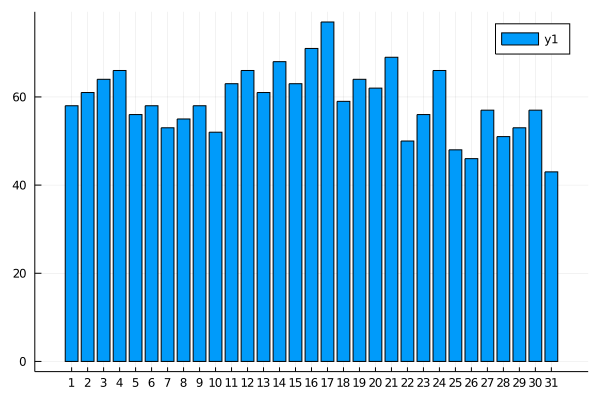
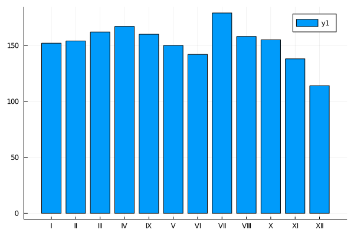

# Pakiety do wszystkich zadań

```julia
using CategoricalArrays
using Statistics
using StatsBase
using DataFrames
using CSV
using FreqTables
using StringEncodings
using Plots
using TexTables
using LinearAlgebra
using Literate # Literate.markdown("rozdzial2/rozdzial-2.jl", "rozdzial2/"; documenter=false, execute=true)
```

# R Zadanie 2.1

Odczytaj ramkę danych z zadania 1.13. Następnie zamień dane liczbowe z kolumny Wiek na zmienną czynnikową, dzieląc pacjentki na 3 grupy: o wieku do 45 lat, o wieku powyżej 55 lat i o wieku pośrednim. Poziomy tej zmiennej powinny nazywać się następująco: `"wiek <45", "45<= wiek <= 55", "wiek >55"`. Następnie wyświetl macierz kontyngencji dla tej zmiennej i dla pary zmiennych wieku oraz dla płci. Dodaj do macierzy sumy brzegowe. Wyświetl płaską macierz kontyngencji dla trójki zmiennych czynnikowych, dwóch powyższych i jeszcze zmiennej `WIT`.

```julia
daneBT = CSV.read(open(read, "rozdzial1/daneBioTech", enc"ISO-8859-2"), DataFrame;
                  delim=';', decimal=',', header=true, normalizenames = true)

daneBT.Wiek_poziomy = cut(daneBT.Wiek, [0, 45, 55.5, maximum(daneBT.Wiek)],
                          labels = ["wiek <45", "45<= wiek <=55", "wiek > 55"],
                          extend=true)
```

```
24-element CategoricalArray{String,1,UInt32}:
 "wiek > 55"
 "wiek > 55"
 "45<= wiek <=55"
 "wiek > 55"
 "wiek <45"
 "wiek > 55"
 "wiek <45"
 "45<= wiek <=55"
 "45<= wiek <=55"
 "wiek > 55"
 "wiek <45"
 "45<= wiek <=55"
 "wiek > 55"
 "wiek > 55"
 "wiek > 55"
 "wiek <45"
 "wiek > 55"
 "45<= wiek <=55"
 "wiek <45"
 "wiek > 55"
 "45<= wiek <=55"
 "wiek <45"
 "wiek <45"
 "45<= wiek <=55"
```

pierwsza tabela

```julia
freqtable(daneBT, :Wiek_poziomy)
```

```
3-element Named Array{Int64,1}
Wiek_poziomy                                     │ 
─────────────────────────────────────────────────┼───
CategoricalValue{String,UInt32} "wiek <45"       │  7
CategoricalValue{String,UInt32} "45<= wiek <=55" │  7
CategoricalValue{String,UInt32} "wiek > 55"      │ 10
```

druga tabela

```julia
freqtable(daneBT, :Wiek_poziomy, :Płeć_K_0_M_1)
```

```
3×2 Named Array{Int64,2}
                           Wiek_poziomy ╲ Płeć_K_0_M_1 │ K  M
───────────────────────────────────────────────────────┼─────
CategoricalValue{String,UInt32} "wiek <45" (1/3)       │ 3  4
CategoricalValue{String,UInt32} "45<= wiek <=55" (2/3) │ 5  2
CategoricalValue{String,UInt32} "wiek > 55" (3/3)      │ 1  9
```

trzecia tabela

```julia
freqtable(daneBT, :Wiek_poziomy, :Płeć_K_0_M_1, :WIT)
```

```
3×2×2 Named Array{Int64,3}

[:, :, WIT=brak] =
                           Wiek_poziomy ╲ Płeć_K_0_M_1 │ K  M
───────────────────────────────────────────────────────┼─────
CategoricalValue{String,UInt32} "wiek <45" (1/3)       │ 1  2
CategoricalValue{String,UInt32} "45<= wiek <=55" (2/3) │ 3  2
CategoricalValue{String,UInt32} "wiek > 55" (3/3)      │ 1  7

[:, :, WIT=obecny] =
                           Wiek_poziomy ╲ Płeć_K_0_M_1 │ K  M
───────────────────────────────────────────────────────┼─────
CategoricalValue{String,UInt32} "wiek <45" (1/3)       │ 2  2
CategoricalValue{String,UInt32} "45<= wiek <=55" (2/3) │ 2  0
CategoricalValue{String,UInt32} "wiek > 55" (3/3)      │ 0  2
```

niestety, nie ma funkcji typu `addmargins` czy ftable (flat table)

# RR Zadanie 2.2
Pod adresem http://www.biecek.pl/R/dane/imieniny.txt znajduje się plik tekstowy z imionami i datami imienin dla kolejnych imion. Plik jest w dosyć kłopotliwym formacie, mianowicie w każdym wierszu w pierwszej pozycji znajduje się imię, a po nim występują daty imienin. Wszystkie te pola rozdzielone są spacją. Ponieważ jednak różne imiona mają różne liczby imienin dane te nie są w postaci tabelarycznej. Odczytaj dane tak, by każdy wiersz był jednym elementem (można np. za separator wskazać ; nie występuje on w tym pliku, cała linia zostanie więc traktowana jako jeden element). Sprawdź ile imion znajduje się w tym pliku z danymi.

```julia
download("http://www.biecek.pl/R/dane/imieniny.txt", "rozdzial2/imieniny.txt")
linie = readlines("rozdzial2/imieniny.txt", enc"ISO-8859-2");
linie[1:10]
```

```
10-element Array{String,1}:
 "Aaron 1.VII"
 "Abel 2.I"
 "Abraham 16.III 15.VI 19.XII"
 "Achilles 7.XI"
 "Ada 6.IV 24.XII"
 "Adam 6.IV 24.XII"
 "Adela 23.XI 24.XII"
 "Adelajda 30.I 5.II 12.XII 16.XII"
 "Adolf 11.II 14.II 19.IV 17.VI 21.VIII"
 "Adolfa 11.II 14.II 19.IV 17.VI 21.VIII"
```

# RRR Zadanie 2.3

Po odczytaniu danych z zadania 2.2 użyj `strsplit()` i `sapply()`, by z odczytanych danych wydobyć tylko informacje o imionach. Zlicz liczby znaków w kolejnych imionach i wyznacz macierz kontyngencji opisującą ile imion ma określoną długość. Sprawdź, które imię ma najwięcej znaków i które imiona mają najmniej znaków. Większość imion żeńskich kończy się literą ‘a’, wykorzystując tę informację zlicz liczbę żeńskich imion. Sprawdź ile liter rozpoczyna się literą A, ile B, ile C itp. Sprawdź, które imiona kończą się suffixem anna. Polskie litery występujące w imionach zamień na odpowiedniki łacińskie, np. ą na a, ź na z itp. Sprawdź, ile imion zawierało polskie litery.

```julia
imiona = map(x -> x[1], split.(linie, " "))
dlugosciImion = length.(imiona);
```

dlugosci imion

```julia
freqtable(dlugosciImion)
```

```
10-element Named Array{Int64,1}
Dim1  │ 
──────┼────
3     │   9
4     │  26
5     │  79
6     │ 144
7     │ 139
8     │ 106
9     │  65
10    │  33
11    │   8
12    │   1
```

ktore najkrotsze

```julia
imiona[dlugosciImion .== minimum(dlugosciImion)]
```

```
9-element Array{SubString{String},1}:
 "Ada"
 "Alf"
 "Ewa"
 "Ida"
 "Iga"
 "Iwo"
 "Jan"
 "Lew"
 "Wit"
```

ktore najdluzsze

```julia
imiona[dlugosciImion .== maximum(dlugosciImion)]
```

```
1-element Array{SubString{String},1}:
 "Hermenegilda"
```

ktore konczą się na a

```julia
imiona[contains.(imiona, r"a$")] |> length
```

```
268
```

pierwsze litery

```julia
SubString.(imiona, 1, 1) |> freqtable
```

```
25-element Named Array{Int64,1}
Dim1   │ 
───────┼───
"A"    │ 63
"B"    │ 47
"C"    │ 15
"D"    │ 26
"E"    │ 35
"F"    │ 16
"G"    │ 16
"H"    │ 25
"I"    │ 17
⋮         ⋮
"R"    │ 33
"S"    │ 35
"T"    │ 15
"U"    │  6
"W"    │ 42
"Z"    │ 18
"\u8c" │  1
"Ł"    │  4
"Ż"    │  1
```

które zawierają anna

```julia
imiona[contains.(imiona, r"anna$")]
```

```
6-element Array{SubString{String},1}:
 "Hanna"
 "Joanna"
 "Julianna"
 "Lilianna"
 "Marianna"
 "Zuzanna"
```

zawierają polskie znaki

```julia
imiona[ contains.(imiona, r"[ąęśćłń󟿥ʌƣŃÓŹŻ]{1,}")]
```

```
80-element Array{SubString{String},1}:
 "Ambroży"
 "Bartłomiej"
 "Błażej"
 "Boguchwała"
 "Bogumił"
 "Bogumiła"
 "Bogusław"
 "Bogusława"
 "Bolesław"
 "Bolesława"
 "Borzysław"
 "Borzysława"
 "Bożena"
 "Bożydar"
 "Bożysław"
 "Bożysława"
 "Bronisław"
 "Bronisława"
 "Budzisław"
 "Budzisława"
 "Chwalibóg"
 "Czesław"
 "Czesława"
 "Dobrosław"
 "Dobrosława"
 "Elżbieta"
 "Gaweł"
 "Grażyna"
 "Jarosław"
 "Jarosława"
 "Jędrzej"
 "Józef"
 "Józefa"
 "Józefina"
 "Ludmiła"
 "Ludomiła"
 "Łazarz"
 "Łucja"
 "Łucjan"
 "Łukasz"
 "Małgorzata"
 "Michał"
 "Mieczysław"
 "Mieczysława"
 "Mikołaj"
 "Miłosz"
 "Mirosław"
 "Mirosława"
 "M\u009ccisław"
 "Paweł"
 "Przemysław"
 "Przybysław"
 "Przybysława"
 "Radosław"
 "Radosława"
 "Rafał"
 "Róża"
 "Sędzimir"
 "Sława"
 "Sławomir"
 "Sławomira"
 "Sobiesław"
 "Sobiesława"
 "Stanisław"
 "Stanisława"
 "Tomisław"
 "Wacław"
 "Wacława"
 "Wiesław"
 "Wiesława"
 "Władysław"
 "Władysława"
 "Włodzimierz"
 "Włodzisław"
 "Włodzisława"
 "Zbysław"
 "Zbysława"
 "Zdzisław"
 "Zdzisława"
 "Żaklina"
```

# RR Zadanie 2.4

Po odczytaniu danych z powyższego zadania sprawdź, kto ma imieniny 30 października. Wyświetl te imiona w porządku leksykograficznym. Sprawdź, które imię ma najczęściej imieniny. Sprawdź, w którym dniu roku najwięcej imion ma imieniny. Sprawdź, w którym dniu miesiąca a następnie, w którym miesiącu najwięcej imion ma imieniny.

Na bazie wszystkich imion zrób analizę używalności poszczególnych liter. Która litera jest najpopularniejsza? Dlaczego?

które imiona obchodzą imieniny 30.10

```julia
imiona[contains.(linie, r"( 30.X$| 30.X )")] |> sort
linie_splitted = split.(linie, " ");
```

które imię ma najwięcej imien

```julia
linie[linie_splitted .|>  length |> argmax]
linie_splitted_full = map(x -> x[2:end], linie_splitted) |> (x -> vcat(x...)) .|> string ;
```

w który dzień jest najwięcej imion

```julia
linie_splitted_full |> countmap |> argmax
dniImienin = [i.match for i in filter(!isnothing,match.(r"\d{1,2}", linie_splitted_full))]
dniImienin = parse.(Int, dniImienin)
linie_miesiace = map(x -> x[end], split.(linie_splitted_full, "."))
linie_miesiace = filter(x -> length(x) >0, linie_miesiace);
```

dni

```julia
freqtable(dniImienin)
```

```
31-element Named Array{Int64,1}
Dim1  │ 
──────┼───
1     │ 58
2     │ 61
3     │ 64
4     │ 66
5     │ 56
6     │ 58
7     │ 53
8     │ 55
9     │ 58
⋮        ⋮
23    │ 56
24    │ 66
25    │ 48
26    │ 46
27    │ 57
28    │ 51
29    │ 53
30    │ 57
31    │ 43
```

miesiące

```julia
freqtable(linie_miesiace)
```

```
12-element Named Array{Int64,1}
Dim1   │ 
───────┼────
"I"    │ 152
"II"   │ 154
"III"  │ 162
"IV"   │ 167
"IX"   │ 160
"V"    │ 150
"VI"   │ 142
"VII"  │ 179
"VIII" │ 158
"X"    │ 155
"XI"   │ 138
"XII"  │ 114
```

wykres wedlug dni

```julia
bar(freqtable(dniImienin), xticks = 1:31)
```


wykres według miesiecy

```julia
bar(freqtable(linie_miesiace), xticks = (1:12, sort(unique(linie_miesiace))))
```


pierwsze litery

```julia
litery = lowercase.(string.(vcat(split.(imiona,"")...)))
freqtable(litery) |> sort
```

```
29-element Named Array{Int64,1}
Dim1  │ 
──────┼────
Œ     │   1
œ     │   1
ę     │   2
ó     │   5
ż     │  10
p     │  46
h     │  51
f     │  55
j     │  66
⋮         ⋮
t     │ 159
s     │ 195
o     │ 226
l     │ 234
r     │ 299
n     │ 301
e     │ 304
i     │ 321
a     │ 693
```

# R Zadanie 2.5

Odczytaj ramkę danych z zadania 1.13. Następnie używając funkcji by() wyświetl podsumowanie zmiennej Wiek osobno dla grupy WIT=brak i dla grupy WIT=obecny.

```julia
by(daneBT, :WIT, describe)
```

```
28×9 DataFrame
│ Row │ WIT    │ variable     │ mean    │ min      │ median  │ max       │ nunique │ nmissing │ eltype                          │
│     │ String │ Symbol       │ Union…  │ Any      │ Union…  │ Any       │ Union…  │ Nothing  │ DataType                        │
├─────┼────────┼──────────────┼─────────┼──────────┼─────────┼───────────┼─────────┼──────────┼─────────────────────────────────┤
│ 1   │ obecny │ Wiek         │ 45.375  │ 24       │ 46.5    │ 59        │         │          │ Int64                           │
│ 2   │ obecny │ Płeć_K_0_M_1 │         │ K        │         │ M         │ 2       │          │ String                          │
│ 3   │ obecny │ WIT          │         │ obecny   │         │ obecny    │ 1       │          │ String                          │
│ 4   │ obecny │ CIT_h_       │ 19.875  │ 13.5     │ 20.0    │ 29.5      │         │          │ Float64                         │
│ 5   │ obecny │ Kreatynina_1 │ 6.675   │ 3.2      │ 7.05    │ 10.4      │         │          │ Float64                         │
│ 6   │ obecny │ Kreatynina_3 │ 4.1125  │ 2.1      │ 3.2     │ 7.5       │         │          │ Float64                         │
│ 7   │ obecny │ Kreatynina_7 │ 3.0375  │ 0.6      │ 2.7     │ 6.9       │         │          │ Float64                         │
│ 8   │ obecny │ Mocznik_1    │ 18.4    │ 10.9     │ 18.7    │ 26.2      │         │          │ Float64                         │
│ 9   │ obecny │ Mocznik_3    │ 16.4375 │ 7.3      │ 16.75   │ 28.8      │         │          │ Float64                         │
│ 10  │ obecny │ Mocznik_7    │ 16.525  │ 3.5      │ 12.25   │ 40.1      │         │          │ Float64                         │
│ 11  │ obecny │ GFR_MDRD_1   │ 11.5485 │ 5.55337  │ 11.2488 │ 19.0577   │         │          │ Float64                         │
│ 12  │ obecny │ GFR_MDRD_3   │ 25.4813 │ 9.79157  │ 22.4047 │ 50.4817   │         │          │ Float64                         │
│ 13  │ obecny │ GFR_MDRD_7   │ 45.5129 │ 11.6829  │ 36.1295 │ 113.51    │         │          │ Float64                         │
│ 14  │ obecny │ Wiek_poziomy │         │ wiek <45 │         │ wiek > 55 │ 3       │          │ CategoricalValue{String,UInt32} │
│ 15  │ brak   │ Wiek         │ 53.125  │ 28       │ 55.5    │ 70        │         │          │ Int64                           │
│ 16  │ brak   │ Płeć_K_0_M_1 │         │ K        │         │ M         │ 2       │          │ String                          │
│ 17  │ brak   │ WIT          │         │ brak     │         │ brak      │ 1       │          │ String                          │
│ 18  │ brak   │ CIT_h_       │ 22.1875 │ 18.0     │ 21.5    │ 31.0      │         │          │ Float64                         │
│ 19  │ brak   │ Kreatynina_1 │ 6.30625 │ 2.2      │ 6.75    │ 10.1      │         │          │ Float64                         │
│ 20  │ brak   │ Kreatynina_3 │ 5.575   │ 1.1      │ 4.9     │ 10.0      │         │          │ Float64                         │
│ 21  │ brak   │ Kreatynina_7 │ 3.6125  │ 1.1      │ 2.55    │ 9.6       │         │          │ Float64                         │
│ 22  │ brak   │ Mocznik_1    │ 16.9875 │ 8.7      │ 15.7    │ 31.8      │         │          │ Float64                         │
│ 23  │ brak   │ Mocznik_3    │ 19.225  │ 7.3      │ 20.45   │ 31.4      │         │          │ Float64                         │
│ 24  │ brak   │ Mocznik_7    │ 14.8562 │ 6.8      │ 12.8    │ 32.5      │         │          │ Float64                         │
│ 25  │ brak   │ GFR_MDRD_1   │ 12.84   │ 6.46455  │ 10.6657 │ 31.3762   │         │          │ Float64                         │
│ 26  │ brak   │ GFR_MDRD_3   │ 21.7688 │ 4.77504  │ 14.0599 │ 84.7872   │         │          │ Float64                         │
│ 27  │ brak   │ GFR_MDRD_7   │ 39.369  │ 7.47321  │ 36.623  │ 84.8303   │         │          │ Float64                         │
│ 28  │ brak   │ Wiek_poziomy │         │ wiek <45 │         │ wiek > 55 │ 3       │          │ CategoricalValue{String,UInt32} │
```

alternatywnie z TexTables.jl

```julia
summarize_by(daneBT,  :WIT, :Wiek)
```

```
       |      | Obs |  Mean  | Std. Dev. | Min | Max 
-----------------------------------------------------
obecny | Wiek |   8 | 45.375 |    12.023 |  24 |  59 
-----------------------------------------------------
  brak | Wiek |  16 | 53.125 |     9.653 |  28 |  70 

```

# R Zadanie 2.6

Wyznacz wyznacznik, wartości własne oraz wektory własne macierzy:

```julia
mat = [1 5 3; 2 0 5; 1 2 1]
det(mat)
eigen(mat)
```

```
Eigen{Float64,Float64,Array{Float64,2},Array{Float64,1}}
values:
3-element Array{Float64,1}:
 -3.207036492093138
 -0.8719890855086495
  6.079025577601787
vectors:
3×3 Array{Float64,2}:
  0.705809  -0.927568  -0.753702
 -0.690034   0.139232  -0.547275
  0.16027    0.346745  -0.363899
```

# RR Zadanie 2.7
Używając funkcji outer() zbuduj i wyświetl na ekranie tabliczkę mnożenia liczb od 1 do 10.

```julia
(1:10) * (1:10)'
```

```
10×10 Array{Int64,2}:
  1   2   3   4   5   6   7   8   9   10
  2   4   6   8  10  12  14  16  18   20
  3   6   9  12  15  18  21  24  27   30
  4   8  12  16  20  24  28  32  36   40
  5  10  15  20  25  30  35  40  45   50
  6  12  18  24  30  36  42  48  54   60
  7  14  21  28  35  42  49  56  63   70
  8  16  24  32  40  48  56  64  72   80
  9  18  27  36  45  54  63  72  81   90
 10  20  30  40  50  60  70  80  90  100
```

# R Zadanie 2.8
Odczytaj ramkę danych z zadania 1.13. Następnie wyznacz histogram dla zmiennej Wiek i zapisz go do pliku hist.pdf w wymiarach 5×5 cali

```julia
p1 = histogram(daneBT.Wiek, bins = :auto, size = (5*96, 5*96), legend = false, color = "white")
savefig(p1, "rozdzial2/hist.pdf")
```

# RRR Zadanie 2.9

Pod adresem http://money.pl/ można odczytać aktualne wartości indeksów giełdowych. Wczytaj zawartość tej strony do programu R, a następnie wyciągnij z niej dane o nazwie i wartościach indeksów. Zauważ, że w treści HTML tabela z nazwami i wartościami indeksów rozpoczyna się od linii <table id="tgpw" class="tabela">.

**Opis jest nieaktualny.**

---

*This page was generated using [Literate.jl](https://github.com/fredrikekre/Literate.jl).*

